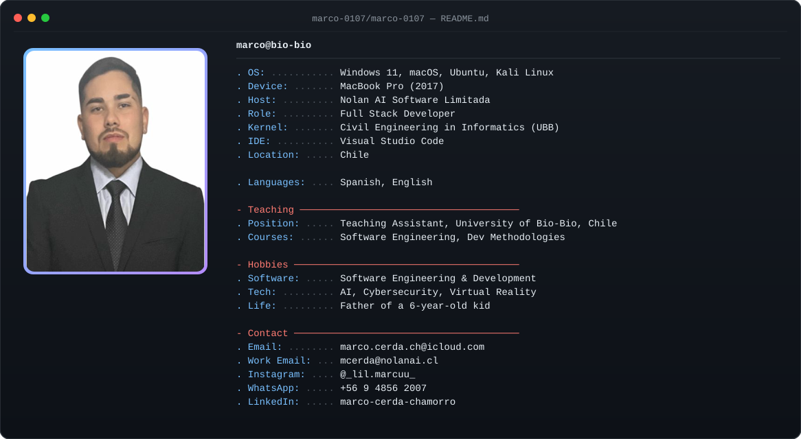
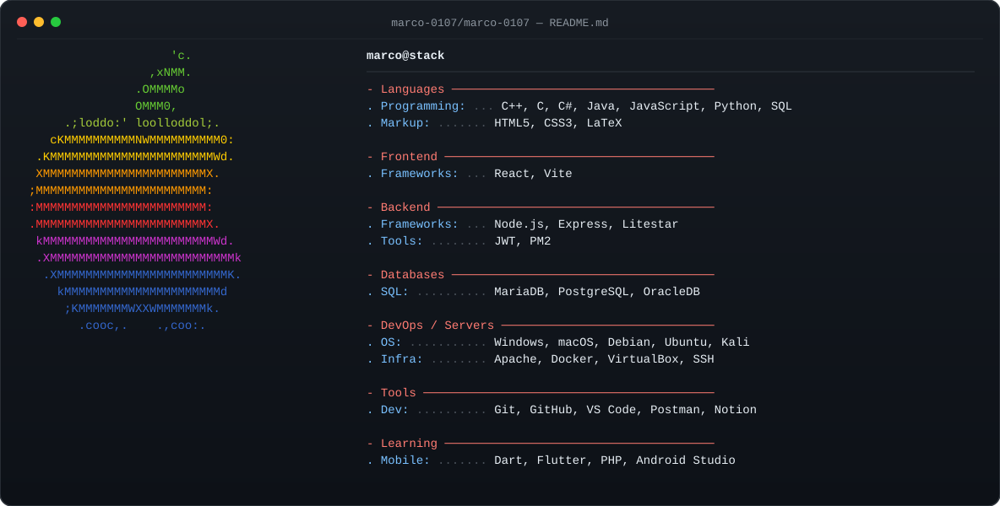

<h1 align="center">¡Hola 👋 Soy Marco Cerda Chamorro!</h1>

  

  

---

## 🧠 Sobre mí

- 👨‍💻 Estudiante Tesista de **Ingeniería Civil en Informática** — Universidad del Bío-Bío.
- 🎓 Titulado en **Técnico de Nivel Medio en Administración mención Recursos Humanos**.
- 💼 Actualmente trabajando de Desarollador Full Stack en **[Nolan AI Software Limitada](https://nolanai.cl/)**.
- 🧑‍🏫 Profesor ayudante de las carreras **Ingeniería Civil en Informática** e **Ingeniería en Ejecución y Computación Informática** para las asignaturas **Ingeniería de Software** y **Metodologías de Desarollo** de la Universidad del Bio-Bio, realizando clases prácticas.
- 👨‍👩‍👧 Padre de un pequeño de 5 años — mi mayor motivación.
- 🚀 Aficionado en **Ingeniería de Software**, **Desarrollo de Software**, **Inteligencia Artificial**, **Ciberseguridad** y **Realidad Virtual**.

---

  
  

